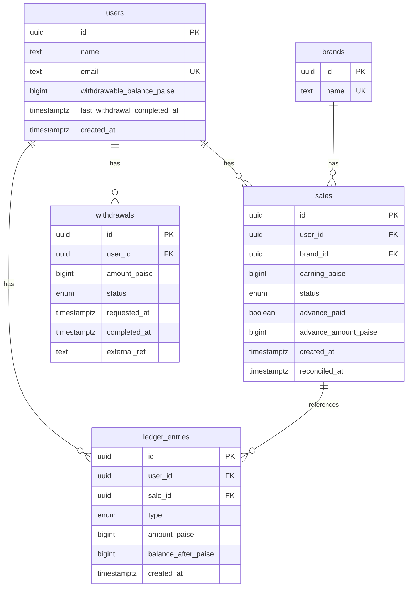

# SettleLedger

Payout management system for affiliate sales — built for Faym.co's SDE Intern take-home. Advance payouts, reconciliation, and withdrawals, all backed by an append-only ledger instead of a single balance field you mutate in place.

**Stack:** Node.js, Express, PostgreSQL (Neon), Prisma

## Live demo

`https://settleledger.onrender.com`

Hosted on Render's free tier, so it spins down after periods of inactivity. First request after idle can take 30-50 seconds to wake back up; everything after that is fast.

## Running it locally

Needs Node 18+ and Postgres 14+.

```bash
git clone <your-repo-url>
cd settleledger
cp .env.example .env
# fill in DATABASE_URL in .env

npm install
npm run db:deploy    # applies migrations
npm run db:seed      # seeds brands, users, and example sales
npm run dev           # http://localhost:3000
```

To confirm the worked example from the assignment brief matches:

```bash
node scripts/test-worked-example.js
```

Expected final balance for `john_doe@example.com` is ₹68.

The seed script also creates a second user, `jane_smith@example.com`, with one unrelated ₹100 sale from a different brand. That's intentional — it means the advance payout batch job has more than one user's sales to process, so the test actually proves the job scans and pays out across all eligible pending sales system-wide, not just the ones belonging to whichever user the worked example happens to use.

### Walking through the worked example

| Step | Action | `finalPayoutRupees` | Balance |
|------|--------|---|---------|
| Start | 3 pending sales, ₹40 each | — | ₹0 |
| Advance job runs | 10% advance per sale (₹4 × 3) | — | ₹12 |
| Reconcile sale 1 (rejected) | −₹4 clawback | −4 | ₹8 |
| Reconcile sale 2 (approved) | +₹36 | 36 | ₹44 |
| Reconcile sale 3 (approved) | +₹36 | 36 | ₹80 |
| Withdraw ₹12 | debited immediately on request | — | ₹68 |
| Settle as SUCCESS | funds sent, balance unchanged | — | ₹68 |

Quick note on the two numbers in that table: `finalPayoutRupees` is what a single `/reconcile` call returns — the net adjustment from just that one sale. Summing the three calls above (−4 + 36 + 36) gets you the ₹68 the assignment's worked example asks for. `newWithdrawableBalanceRupees` (₹80 after all three) is the running total in the user's account, which also includes the ₹12 advance paid out earlier. Neither number is wrong, they're just answering different questions — one's a per-event delta, the other's a running balance.

## Schema



## API

Request and response bodies use rupees. Internally everything is stored as integer paise (₹1 = 100 paise) so there's no floating-point rounding to worry about.

| Method | Path | Description |
|--------|------|-------------|
| POST | `/api/brands` | Create a brand — `{ name }` |
| POST | `/api/users` | Create a user — `{ name, email }` |
| POST | `/api/sales` | Create a sale — `{ userId, brandId, earningRupees }` |
| GET | `/api/sales?userId=` | List a user's sales |
| POST | `/api/payouts/advance/run` | Run the advance payout batch job |
| POST | `/api/admin/sales/:saleId/reconcile` | `{ status: "approved" \| "rejected" }` → returns `{ sale, finalPayoutRupees, newWithdrawableBalanceRupees }` |
| GET | `/api/users/:userId/balance` | Current withdrawable balance |
| GET | `/api/users/:userId/ledger` | Full ledger / audit trail |
| POST | `/api/withdrawals` | `{ userId, amountRupees }` |
| POST | `/api/withdrawals/:id/settle` | `{ status: "SUCCESS" \| "FAILED" \| "CANCELLED" \| "REJECTED" }` |

Postman collection is at `postman/SettleLedger.postman_collection.json`.

## Code layout

```
settleledger/
├── prisma/
│   ├── schema.prisma          # models + migrations
│   └── seed.js                # 3 brands, john_doe (worked example), jane_smith
├── src/
│   ├── config/prisma.js       # Prisma client singleton
│   ├── utils/
│   │   ├── money.js           # toPaise, toRupees, floorPercent
│   │   ├── serialize.js       # response mappers (paise -> rupees)
│   │   └── errors.js          # AppError + asyncHandler
│   ├── services/
│   │   ├── ledgerService.js   # writes ledger entries, updates balance
│   │   ├── payoutService.js   # advance batch job + reconciliation
│   │   └── withdrawalService.js # initiate + settle withdrawals
│   ├── controllers/apiController.js
│   ├── routes/
│   ├── app.js
│   └── index.js
├── scripts/test-worked-example.js
├── postman/SettleLedger.postman_collection.json
├── package.json
└── README.md
```

`ledgerService.record()` is the only place in the codebase that writes a ledger row and updates `users.withdrawable_balance_paise`. It always runs inside whatever transaction the caller opened, so the two can't drift apart.

## Why it's built this way

Every credit or debit — an advance, an approval, a rejection clawback, a withdrawal, a reversal — gets written as its own row in `ledger_entries` and is never touched again after that. `withdrawable_balance_paise` on the user is just a running total kept in sync with those rows inside the same transaction. I went with this over a plain mutable balance column mainly because the two hardest parts of the brief get a lot easier once you have it: idempotency (an advance can never be paid twice even if the batch job runs multiple times) and auditability (you can always answer "why does this user have ₹80?" by reading the ledger instead of trusting a number that's been silently overwritten a dozen times).

Money is stored as integer paise (`bigint`), not floats. 10% of an odd rupee amount doesn't divide evenly, and float arithmetic on currency is a classic source of off-by-a-paisa bugs. Conversion to rupees only happens at the API boundary.

The 24-hour withdrawal cooldown is keyed off successful completion, not the withdrawal request itself — `last_withdrawal_completed_at` only updates when a withdrawal settles as `SUCCESS`. If one fails, gets cancelled, or gets rejected, the amount is credited back and the cooldown clock never starts. This was a deliberate call: the assignment's failed-payout-recovery rule doesn't really mean anything if a failed transfer also costs the user a full day of access to their own money.

Each sale in the advance batch job runs in its own transaction rather than one big transaction for the whole batch. If one sale's advance throws for some reason, it shouldn't take the rest down with it. The actual protection against double-paying on concurrent job runs is the row lock plus a re-check of `advance_paid` inside that lock, not just the initial query filter — a plain `WHERE advance_paid = false` filter alone isn't enough once two job runs can overlap.

Sale earnings don't have an update endpoint. `earning_paise` is treated as fixed once a sale is created, set by whatever upstream system is reporting the sale in the first place. If that assumption doesn't hold for a real deployment, adding an update path wouldn't be hard — the part that actually matters (never issuing a second advance on the same sale) doesn't change either way.

With more time I'd swap the `/settle` endpoint for a real payment gateway webhook, add admin auth in front of the reconcile endpoint (right now it's wide open, fine for a take-home, not for production), and probably block new withdrawals once a user's balance goes negative instead of letting it sit as a running debt.

## Edge cases handled

| Scenario | Handling |
|---|---|
| Advance batch job runs twice (or concurrently) | Row lock (`SELECT ... FOR UPDATE`) plus a re-check of `advance_paid` inside the transaction |
| Reconciling a sale that's already been reconciled | `409` — status only moves `pending → approved` or `pending → rejected`, once |
| Reconciling a sale that never got an advance | `advance_amount_paise` is 0, so approved pays the full earning and rejected adjusts by ₹0 |
| Balance goes negative after a rejection clawback | Allowed — treated as a debt recovered against future approved sales. Blocking withdrawals below zero is listed above as a possible follow-up |
| Withdrawal requested above the current balance | `400` |
| Duplicate settlement webhook for the same withdrawal | `/settle` is idempotent — a withdrawal already in a terminal state just returns `200` without touching the ledger again |
| Two withdrawal requests racing within the same 24h window | Row lock on the user when checking the cooldown and creating the withdrawal |
| Sale earning changing after creation | Not supported — treated as immutable, see above |

## Deploying (Render + Neon Postgres)

1. New Render **Web Service**, connected to this repo.
2. Database is [Neon](https://neon.tech) Postgres, external to Render. Set `DATABASE_URL` in the Web Service's environment variables to the Neon pooled connection string, with `?sslmode=require&channel_binding=require` appended — Neon requires SSL.
3. Build command: `npm install && npx prisma generate && npx prisma migrate deploy`
   Render doesn't have a separate post-deploy hook the way Railway does, so migrations just run as part of the build.
4. Start command: `npm start`
5. `PORT` is set by Render automatically and read via `process.env.PORT`.
6. After the first successful deploy, seed once from your local machine against the same `DATABASE_URL`:
   ```bash
   npm run db:seed
   ```
   Neon's connection string works the same locally and in production since it isn't restricted to Render's internal network — just make sure your local `.env` points at the same database, or a separate one if you'd rather keep prod and dev data apart.

## Scripts

| Command | What it does |
|---|---|
| `npm start` | production server |
| `npm run dev` | dev server with nodemon |
| `npm run db:migrate` | create/apply dev migrations |
| `npm run db:deploy` | apply migrations in production |
| `npm run db:seed` | seed example data |
| `node scripts/test-worked-example.js` | runs the worked example end to end |

## License

ISC