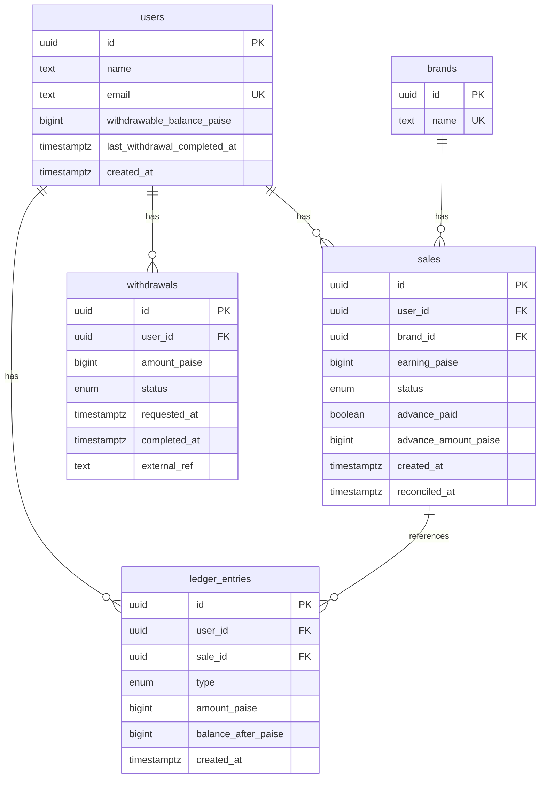

# SettleLedger

A payout management system for affiliate sales, built for Faym.co's SDE Intern assignment. Handles advance payouts, reconciliation, and withdrawals using an append-only ledger instead of a single mutable balance field.

**Stack:** Node.js, Express, PostgreSQL, Prisma

## Live demo

`<add your Railway/Render URL here>`

## Running it locally

You'll need Node 18+ and Postgres 14+.

```bash
git clone <your-repo-url>
cd settleledger
cp .env.example .env
# set DATABASE_URL in .env

npm install
npm run db:deploy    # applies migrations
npm run db:seed      # seeds brands, users, and the example sales
npm run dev           # http://localhost:3000
```

To check the worked example from the assignment brief:

```bash
node scripts/test-worked-example.js
```

Expected final balance for `john_doe@example.com` is ₹68.

### Walking through the worked example

| Step | Action | `finalPayoutRupees` | Balance |
|------|--------|---|---------|
| Start | 3 pending sales, ₹40 each | — | ₹0 |
| Advance job runs | 10% advance per sale (₹4 × 3) | — | ₹12 |
| Reconcile sale 1 (rejected) | −₹4 clawback | −4 | ₹8 |
| Reconcile sale 2 (approved) | +₹36 | 36 | ₹44 |
| Reconcile sale 3 (approved) | +₹36 | 36 | ₹80 |
| Withdraw ₹12 | debited immediately on request | — | ₹68 |
| Settle as SUCCESS | funds sent, balance unchanged | — | ₹68 |

`finalPayoutRupees` is the net adjustment returned by a *single* `/reconcile` call — it matches the ₹68 figure from the assignment's worked example only if you sum the three individual reconcile calls above (−4 + 36 + 36 = 68). `newWithdrawableBalanceRupees` (₹80 after all three) is the cumulative running balance, which also includes the ₹12 advance paid earlier. Both numbers are correct — they're just answering different questions.

## Schema



## API

Request and response bodies use rupees. Internally, everything is stored as integer paise (₹1 = 100 paise) to avoid floating-point rounding issues.

| Method | Path | Description |
|--------|------|-------------|
| POST | `/api/brands` | Create a brand — `{ name }` |
| POST | `/api/users` | Create a user — `{ name, email }` |
| POST | `/api/sales` | Create a sale — `{ userId, brandId, earningRupees }` |
| GET | `/api/sales?userId=` | List a user's sales |
| POST | `/api/payouts/advance/run` | Run the advance payout batch job |
| POST | `/api/admin/sales/:saleId/reconcile` | `{ status: "approved" \| "rejected" }` → returns `{ sale, finalPayoutRupees, newWithdrawableBalanceRupees }` |
| GET | `/api/users/:userId/balance` | Current withdrawable balance |
| GET | `/api/users/:userId/ledger` | Full ledger / audit trail |
| POST | `/api/withdrawals` | `{ userId, amountRupees }` |
| POST | `/api/withdrawals/:id/settle` | `{ status: "SUCCESS" \| "FAILED" \| "CANCELLED" \| "REJECTED" }` |

A Postman collection is included at `postman/SettleLedger.postman_collection.json`.

## Code layout

```
src/
├── config/prisma.js          # Prisma client singleton
├── utils/
│   ├── money.js              # toPaise, toRupees, floorPercent
│   ├── serialize.js          # response mappers (paise -> rupees)
│   └── errors.js             # AppError + asyncHandler
├── services/
│   ├── ledgerService.js      # writes ledger entries, updates balance
│   ├── payoutService.js      # advance batch job + reconciliation
│   └── withdrawalService.js  # initiate + settle withdrawals
├── controllers/apiController.js
├── routes/index.js
├── app.js
└── index.js
```

`ledgerService.record()` is the only place in the codebase that writes a ledger row and updates `users.withdrawable_balance_paise`. It always runs inside whatever transaction the caller opened, so a ledger write and a balance update can never get out of sync.

## Why it's built this way

**Ledger instead of a plain balance column.** Every credit or debit — an advance, an approval adjustment, a rejection clawback, a withdrawal, a reversal — is written as its own row in `ledger_entries` and never edited afterward. `withdrawable_balance_paise` on the user is just a running total kept in sync with those rows. I went this route mainly because it makes the two hardest requirements in the brief straightforward instead of fragile: idempotency (advance payouts must never double up even if the batch job runs twice) and auditability (you can always answer "why does this user have ₹80?" by reading the ledger, rather than trusting a number that's been mutated in place).

**Money as integer paise, not floats.** 10% of an odd rupee amount doesn't divide cleanly, and float arithmetic on money is a well-known source of off-by-a-paisa bugs. Everything is `bigint` paise in the database and only gets converted to rupees at the API boundary.

**The 24-hour cooldown is keyed off successful completion, not the withdrawal request.** `last_withdrawal_completed_at` only updates when a withdrawal settles as `SUCCESS`. If a withdrawal fails, is cancelled, or is rejected, the amount is credited back and the cooldown clock never starts. This was a judgment call — the assignment's Failed Payout Recovery section only makes sense if a failed transfer doesn't also cost the user a day of access to their own money.

**Each sale in the advance batch job gets its own transaction.** If one sale's advance payout throws for some reason, it shouldn't take the other nine down with it. Per-sale transactions with a row lock and a re-check of `advance_paid` inside the lock is what actually prevents double-paying on concurrent job runs, not just the initial `advance_paid = false` filter.

**Sale earnings don't have an update endpoint.** I'm treating `earning_paise` as fixed at creation time, set by whatever upstream system reports the sale. If that's wrong for a real production system, it's a small addition — the invariant that matters (never issue a second advance on a sale) doesn't change.

**What I'd add with more time:** real gateway integration instead of the `/settle` stand-in, admin auth on the reconcile endpoint (right now anyone can call it, which is fine for a take-home but not for production), and probably blocking new withdrawals once a user's balance goes negative rather than letting it run as a debt.

## Edge cases handled

| Scenario | Handling |
|---|---|
| Advance batch job runs twice (or concurrently) | Row lock (`SELECT ... FOR UPDATE`) plus a re-check of `advance_paid` inside the transaction |
| Reconciling a sale that's already been reconciled | `409` — status only moves `pending → approved` or `pending → rejected`, once |
| Reconciling a sale that never got an advance | `advance_amount_paise` is 0, so approved pays the full earning and rejected adjusts by ₹0 |
| Balance goes negative after a rejection clawback | Allowed — it's a debt recovered against future approved sales. Blocking withdrawals below zero is listed above as a possible follow-up |
| Withdrawal requested above the current balance | `400` |
| Duplicate settlement webhook for the same withdrawal | `/settle` is idempotent — a withdrawal already in a terminal state just returns `200` without touching the ledger again |
| Two withdrawal requests racing within the same 24h window | Row lock on the user when checking the cooldown and creating the withdrawal |
| Sale earning changing after creation | Not supported — treated as immutable, see above |

## Deploying (Railway)

1. New Railway project, add a Postgres plugin and a Node service.
2. `DATABASE_URL` comes from the Postgres plugin automatically once linked.
3. `PORT` is set by Railway.
4. On deploy, `railway.json` runs `prisma migrate deploy` before starting the server.
5. Seed once after the first deploy: `railway run npm run db:seed`

## Scripts

| Command | What it does |
|---|---|
| `npm start` | production server |
| `npm run dev` | dev server with nodemon |
| `npm run db:migrate` | create/apply dev migrations |
| `npm run db:deploy` | apply migrations in production |
| `npm run db:seed` | seed example data |
| `node scripts/test-worked-example.js` | runs the worked example end to end |

## License

ISC